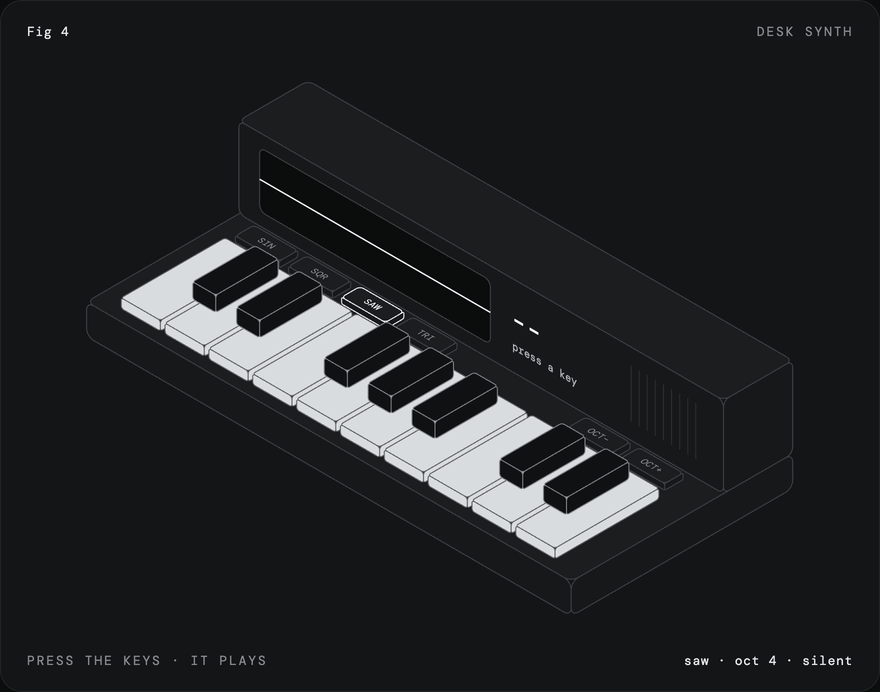
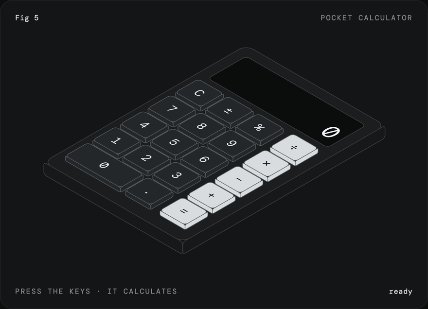

# iso-figure

A skill for Claude that draws interactive isometric figures. Name an object and you get back one HTML file: a hairline isometric drawing on a numbered plate, with parts that work when you press them.

<a href="https://mrbongoc.github.io/ai-iso-skill/examples/desk-synth.html"></a>

<a href="https://mrbongoc.github.io/ai-iso-skill/examples/pocket-calculator.html"></a>

Both were made with the skill. Click either one to play with it, or open the files in [examples](examples/).

## How it works

The figures are plain SVG with no libraries. About 15 lines of projection code turn each face of a box into an SVG `matrix()`, so ordinary rects, text and paths drawn flat land on the right isometric plane, text and rounded corners included. Paint order handles depth. One state object and one `render()` drive the interaction, and CSS does the motion.

Before drawing anything, the skill has Claude decide what pressing a part produces: typed text, a number, a note. If the object has nothing to press, it picks a different object.

[SKILL.md](skills/iso-figure/SKILL.md) has the kernel, the procedure, and the rules for the look.

## Install

Claude Code, as a plugin:

```
/plugin marketplace add MrBongoC/ai-iso-skill
/plugin install iso-figure@ai-iso-skill
```

Or copy the skill folder in by hand:

```
git clone https://github.com/MrBongoC/ai-iso-skill.git
cp -r ai-iso-skill/skills/iso-figure ~/.claude/skills/
```

On Claude.ai, download `iso-figure.skill` from the [latest release](https://github.com/MrBongoC/ai-iso-skill/releases/latest) and upload it in your skill settings.

## Using it

Ask for a figure of something with parts you can press:

```
iso figure of a kitchen timer with minute buttons and a display that counts down
fig 6, a wall light switch that turns a lamp on and off
```

## License

MIT
